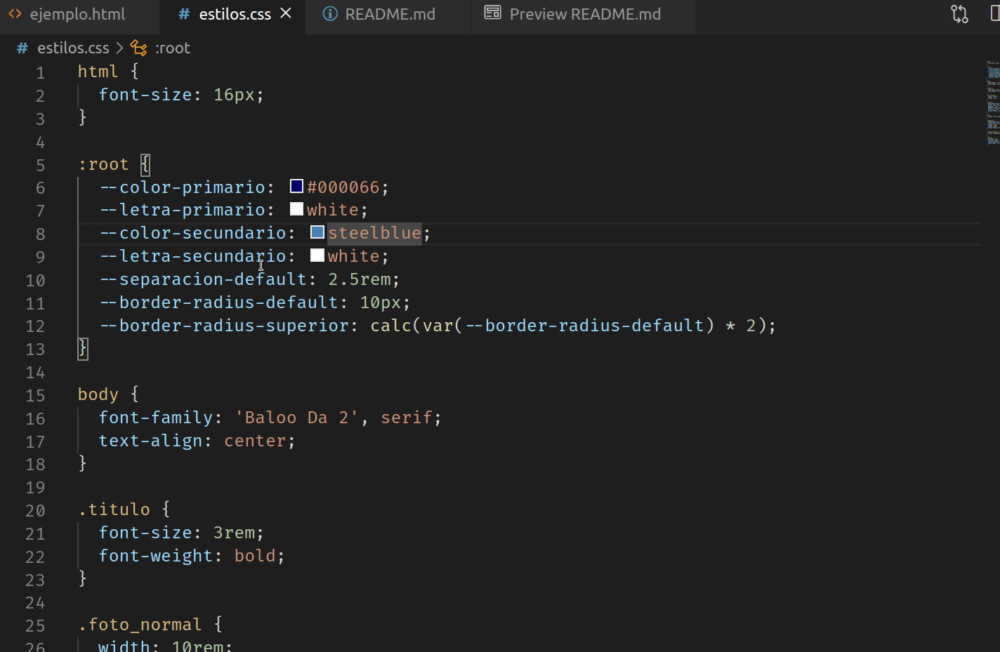

## Ejemplo Variables CSS

Hace un tiempo la especificación de CSS comenzó a permitir el uso de variables, que técnicamente se conocen como **custom properties**. 

https://caniuse.com/#search=css%20var

Recordemos que css no es un lenguaje de programación, entonces la intención es más bien parametrizar ciertas definiciones que podrían estar repetidas, o bien encontrar nombres apropiados y más expresivos para ciertos valores en nuestra definición de estilos.

## La página

En el archivo `ejemplo.html` estamos maquetando una página de confirmación de un ítem que queremos comprar / agregar a un carrito de compras:


## Parametrizaciones

En la página establecemos

- colores primarios y secundarios, en tonalidades de azul
- la letra del color primario y secundario es blanca
- también queremos definir el espacio entre filas fijo. Podríamos usar rem pero la ventaja de definirlo con una variable es que vamos a ponerle un nombre más representativo
- y por último, el borde redondeado permite que utilicemos la función `calc` de css para hacer un cálculo simple: el border-radius grande es el doble del border-radius por defecto

Para ello, tenemos que definir en el raíz del documento las custom properties, de la siguiente manera:

```css
:root {
  --color-primario: #000066;
  --letra-primario: white;
  --color-secundario: steelblue;
  --letra-secundario: white;
  --separacion-default: 2.5rem;
  --border-radius-default: 10px;
  --border-radius-grande: calc(var(--border-radius-default) * 2);
}
```

## Cómo se utilizan en el contexto de CSS

Cuando necesitamos definir el botón con el color primario, escribimos en nuestra hoja de estilos

```css
.primario {
  background-color: var(--color-primario);
  color: var(--letra-primario);
  height: 3rem;
  width: 10rem;
  border-radius: var(--border-radius-default);
}
```

Al definir el precio, estaremos usando el border-radius mayor:

```css
.precio {
  background-color: var(--color-secundario);
  color: var(--letra-secundario);
  padding: 1rem;
  margin: var(--separacion-default) 30rem;
  font-size: 2em;
  border-radius: var(--border-radius-grande);
}
```

## Ventajas

Si el cliente decide utilizar una paleta de colores basado en el color naranja, una ventaja es que tenemos la definición de los colores en un solo lugar. Además, utilizamos nombres **semánticos**: no "color-azul", ni "color-celestito", sino "primario" y el color primario seguirá siendo esencialmente el primario.



Lo mismo podemos hacer para acortar o agrandar la distancia entre cada elemento, o bien para definir nuestro border-radius.

## Cuando la variable CSS puede no ser una buena idea

Una idea que originalmente pensamos fue definir dinámicamente el color de hover del botón "Comprar". Lamentablemente, la manipulación de colores en CSS puro es bastante limitado, comparado con otras tecnologías como

- [SASS](https://thoughtbot.com/blog/controlling-color-with-sass-color-functions)
- o bien la manipulación directa del DOM (el HTML) en javascript

que están fuera del alcance de este ejemplo. No obstante, una alternativa simple es utilizar la propiedad filter, de la siguiente manera:

```css
.primario:hover {
  filter: brightness(75%);
}
```

Esto permite dar un efecto rápido sin que tengamos que hacer manipulaciones de los colores de nuestros elementos:


## Modificando valores de las variables

El lector podrá dudar de la naturaleza "variable" de las custom properties de CSS, porque estamos usándolas principalmente como constantes. En realidad podemos pisar los valores que por defecto se asignan en el root element. Por ejemplo, podríamos cambiar el color primario en el precio:

```css
.precio {
  --color-secundario: #1ab348;
  background-color: var(--color-secundario);
```

Y de paso podríamos pedirle al botón "Comprar" que tome el color secundario:

```css
.primario {
  background-color: var(--color-secundario);
  ...
```

(sí, el ejemplo es didáctico, no conviene definir una clase "primario" que apunte al color secundario)

El color verde que le aplicamos a la clase precio se activa **en cascada** en base a las reglas de especificidad que vimos antes. Por eso

- el precio se visualiza de color verde, porque la variable `color-secundario` se pisa con el valor `#1ab348`
- pero el botón Comprar tiene la clase primario, que sigue tomando la definición de la variable `color-secundario` en base al root element, es decir sigue siendo `steelblue`


Esta posibilidad de pisar los valores que por defecto se toman del root element puede ser una técnica útil.


## Material adicional

- [Custom properties](https://developer.mozilla.org/es/docs/Web/CSS/Using_CSS_custom_properties)
- [CSS Variables explained with 5 examples](https://codeburst.io/css-variables-explained-with-5-examples-84adaffaa5bd)
- [Artículos de variables de css en CSS Tricks](https://css-tricks.com/guides/css-custom-properties/)
- [Performance of CSS variables](https://lisilinhart.info/posts/css-variables-performance)
